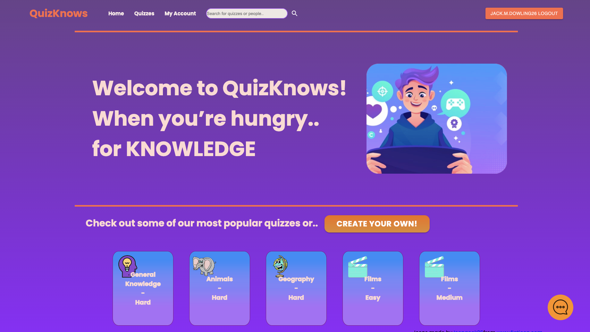
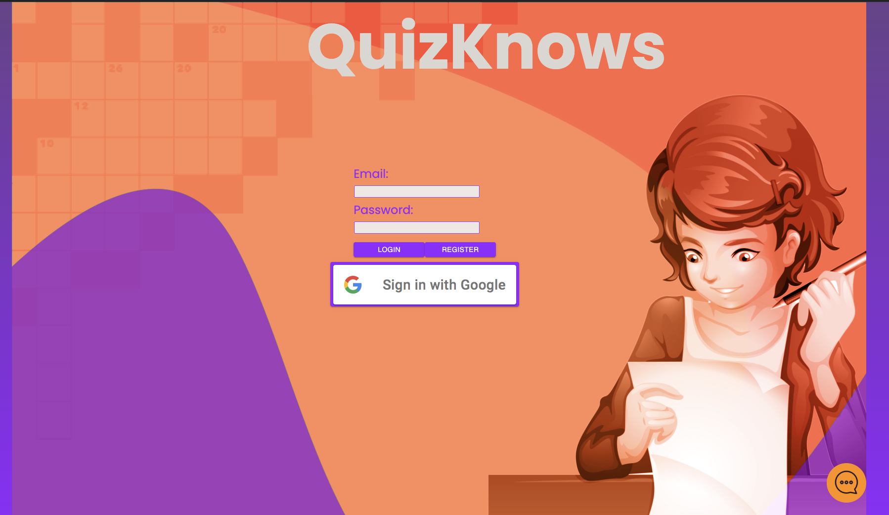
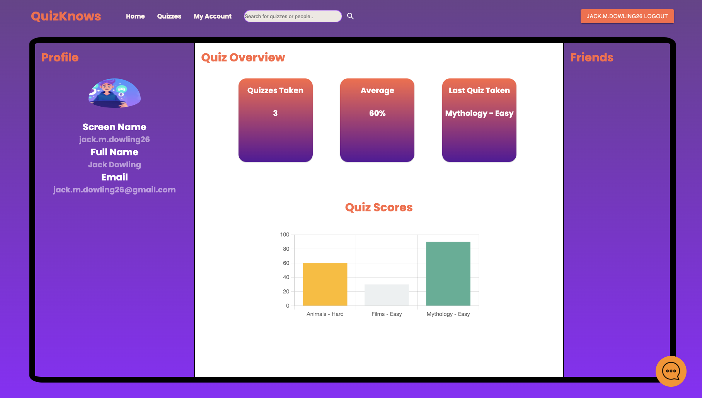
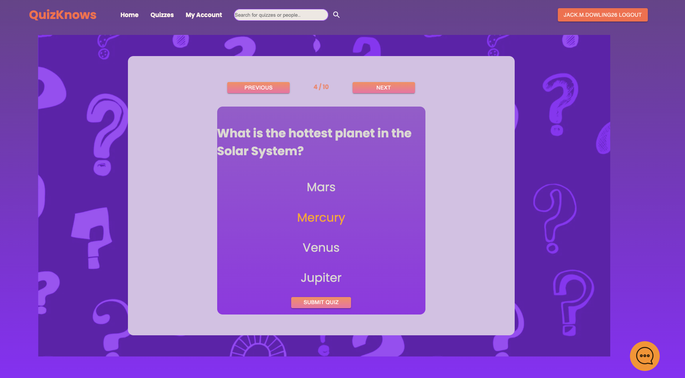
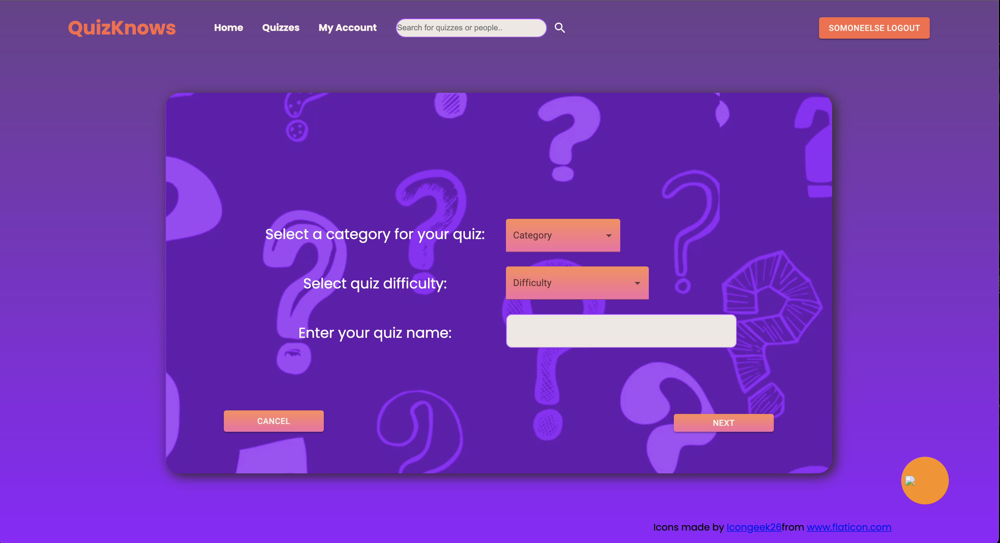
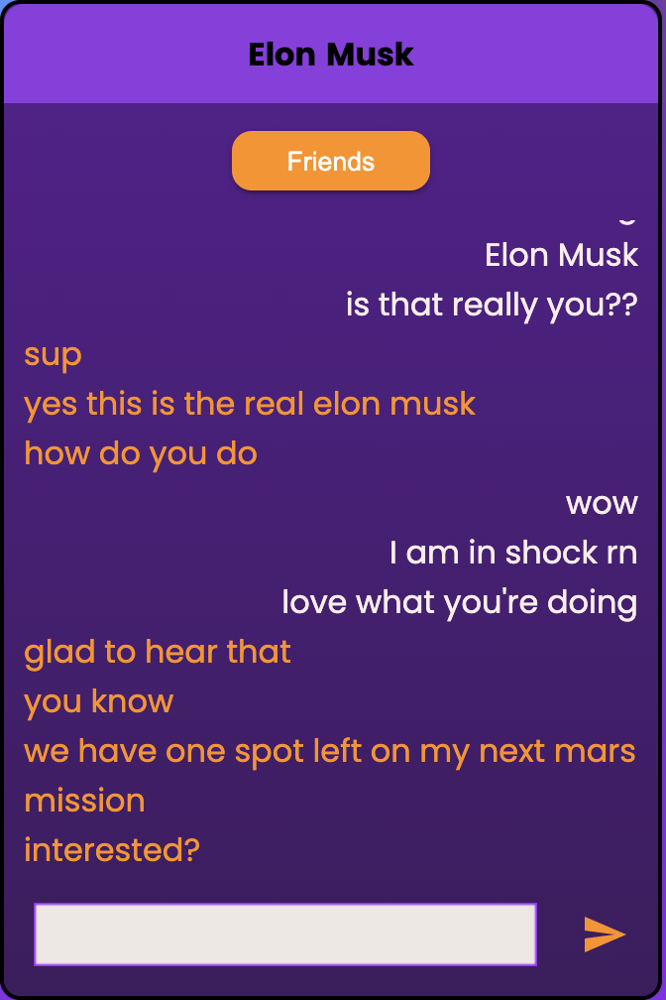

# QuizKnows
## Quizzes for a Modern Age

---

## Project Overview:

In the ever-changing uncertainty of the modern world, what can give more comfort than the gift of knowledge? It was with this inspiration that our bold founder, Randy Randerson, set out to create a web-page that let people from all around the world share what they had learned in a fun, dynamic format. Quizknows aims to be an industry-leading social media platform in the fight against world hunger... for knowledge.

---
---

## Table of contents:

* Description
  * Homepage
  * Login
  * Profile
  * Quiz Page
  * Quiz Creation
  * Chat Function
* Installation
* Project Details
  * Team Members
  * Languages Used
  * Additional Info

---
---

# Description

## Homepage

**Homepage**:

* Write some stuff here

---

## Login

**Login**:

There are two forms of authentication on this app.  There is a google authentication option, which uses Google's api to log in.  When using this option it allows google to do the validation of the user and then sending back the information about the user.

The other option for authentication is to register locally on the website.  To register you need to fill out a standard form with input fields of email, username, first name, last name, a profile thumbnail image url (optional), and then there are two password fields.  Each field will be scrubbed so that it doesn't do anything harmful to our website or backend.  This includes dropping tables or the entire database.  There is also form validation to make sure each input is valid for the field that it is given in.  If everything is correct then the user data will be submitted to our database.

Once the user is registered, they will be signed in automatically.  Regardless of how a user chooses to sign in their authentication cookie will expire in 12 hours, unless they sign out earlier. 

---

## Profile

**Profile**:

* After creating an account with Quizknows all of your quiz data will be stored and viewable. The profile page includes your account information, your records with quizzes taken, and a list of friends! Using the graph centered on the page, you can see your progress over time as you take more quizzes. You also have the ability to click through your friends list and see how your friends did on the quizzes they've taken!

---
## Quiz Page

**Quiz Page**:

* Write some stuff here

---
## Quiz Creation

**Quiz Creation**:

* Write some stuff here

---
## Chat Function

**Chat Function**:

* Chat with your friends from anywhere on the QuizKnows website! Note that you must be logged in to access the chat feature. 

---
---

# Installation

## From local directory,

1) Install dependencies by running `npm install`

2) Run webpack to bundle by running `npm run build`

3) Create a file in the root project folder called '.env'. Inside that file input your password for postgres in the following format: PASSWORD= 'your password'

4) Time to populate the database. Make sure you have postgres installed on your computer and run `npm run load`

5) Finally use `npm start` to start the server, navigate to the page on your favorite browser, and enjoy the knowledge!
---
---

# Project Details

---

## Team Members:

 > * **[Ian Swensson](https://www.linkedin.com/)** Project Manager

 > * **[Andrew Bunys](https://www.linkedin.com/)** job title

 > * **[John Duval](https://www.linkedin.com/)** job title

 > * **[Jack Dowling](https://www.linkedin.com/in/jackmdowling/)** System Architect

 > * **[Wilson Wong](https://www.linkedin.com/)** System Architect

 > * **[Matt Olsen](https://www.linkedin.com/)** job title
---

## Languages and Frameworks Used

* Vanilla [HTML](https://developer.mozilla.org/en-US/docs/Web/HTML), [CSS](https://www.w3.org/Style/CSS/Overview.en.html), and [JavaScript](https://developer.mozilla.org/en-US/docs/Web/JavaScript)

* [React](https://reactjs.org/)

  * _Including_ [React Hooks](https://reactjs.org/docs/hooks-intro.html) _and class-less components_
  * _And [React Router](https://reactrouter.com/)

* [NodeJS](https://nodejs.org/en/)

* [ExpressJS](https://expressjs.com/)

* [Axios](https://axios-http.com/)
 
* [PostgreSQL](https://www.postgresql.org/)

* [WebPack](https://webpack.js.org/)

* [Material UI](https://mui.com/)
 
* [Chart JS](https://www.chartjs.org/)

---

## Additional Info

