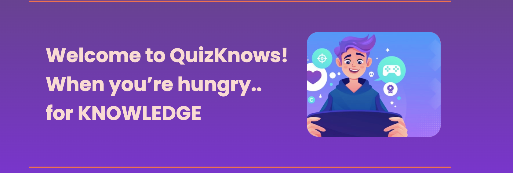
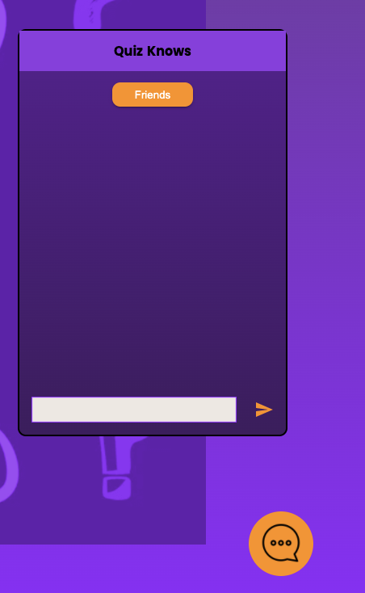

# QuizKnows
## Quizzes for a Modern Age

---

## Project Overview:

In the ever-changing uncertainty of the modern world, what can give more comfort than the gift of knowledge? It was with this inspiration that our bold founder, Randy Randerson, set out to create a web-page that let people from all around the world share what they had learned in a fun, dynamic format. Quizknows aims to be an industry-leading social media platform in the fight against world hunger... for knowledge.

---
---

## Table of contents:

* Description
  * Homepage
  * Login
  * Profile
  * Quiz Page
  * Quiz Creation
  * Chat Function
* Installation
* Project Details
  * Team Members
  * Languages Used
  * Additional Info

---
---

# Description

## Homepage

**Homepage**:

* Write some stuff here

---

## Login

**Login**:

* Write some stuff here

---

## Profile

**Profile**:

* Write some stuff here

---
## Quiz Page

**Quiz Page**:

* Write some stuff here

---
## Quiz Creation

**Quiz Creation**:

* Write some stuff here

---
## Chat Function

**Chat Function**:

* Chat with your friends from anywhere on the QuizKnows website! Note that you must be logged in to access the chat feature. 

---
---

# Installation

## From local directory,

1) Install dependencies by running `npm install`

2) Run webpack to bundle by running `npm run build`

3) Time to populate the database. Make sure you have postgres installed on your computer and run `npm run load`

4) Finally use `npm start` to start the server, navigate to the page on your favorite browser, and enjoy the knowledge!
---
---

# Project Details

---

## Team Members:

 > * **[Ian Swensson](https://www.linkedin.com/)** job title

 > * **[Andrew Bunys](https://www.linkedin.com/)** job title

 > * **[John Duval](https://www.linkedin.com/)** job title

 > * **[Jack Dowling](https://www.linkedin.com/in/jackmdowling/)** System Architect

 > * **[Wilson Wong](https://www.linkedin.com/)** job title

 > * **[Matt Olsen](https://www.linkedin.com/)** job title
---

## Languages and Frameworks Used

* Vanilla [HTML](https://developer.mozilla.org/en-US/docs/Web/HTML), [CSS](https://www.w3.org/Style/CSS/Overview.en.html), and [JavaScript](https://developer.mozilla.org/en-US/docs/Web/JavaScript)

* [React](https://reactjs.org/)

  * _Including_ [React Hooks](https://reactjs.org/docs/hooks-intro.html) _and class-less components_
  * _And [React Router](https://reactrouter.com/)

* [NodeJS](https://nodejs.org/en/)

* [ExpressJS](https://expressjs.com/)

* [Axios](https://axios-http.com/)

* [WebPack](https://webpack.js.org/)

* [Material UI](https://mui.com/)

---

## Additional Info

